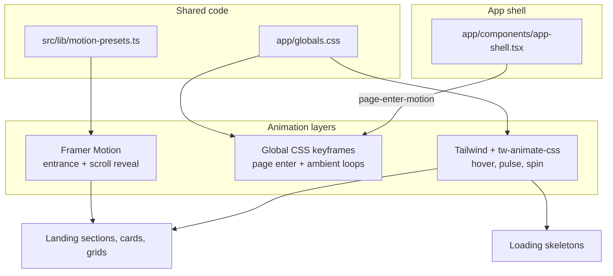

# Website animations guide

How motion is implemented on the APFSPN member website (`apps/website-member`) and how to add or reuse the same patterns in other apps or sections.

The site uses a **layered approach**: shared presets for entrance motion, CSS for page transitions and ambient effects, and Tailwind utilities for hover and loading states.

---

## Architecture



| Layer              | Technology                                      | Best for                                             |
| ------------------ | ----------------------------------------------- | ---------------------------------------------------- |
| Entrance / scroll  | [Framer Motion](https://www.framer.com/motion/) | Hero stagger, cards fading in on scroll, list delays |
| Route transition   | CSS `@keyframes`                                | Subtle fade/slide when navigating between pages      |
| Ambient decoration | CSS infinite animations                         | Floating blobs, gradients, shimmer accents           |
| Micro-interaction  | Tailwind `transition-*`, `hover:*`              | Card lift, button color change                       |
| Loading            | Tailwind `animate-pulse` / `animate-spin`       | Skeleton placeholders, submit spinners               |

**Dependency:** `framer-motion` and `tw-animate-css` are declared in `apps/website-member/package.json`. Global styles import Tailwind and `tw-animate-css` in `app/globals.css`.

---

## 1. Shared motion presets

Reusable Framer Motion variants live in:

`apps/website-member/src/lib/motion-presets.ts`

```ts
import type { Variants } from "framer-motion";

export const fadeUp: Variants = {
  hidden: { opacity: 0, y: 28 },
  visible: {
    opacity: 1,
    y: 0,
    transition: { duration: 0.55, ease: [0.22, 1, 0.36, 1] },
  },
};

export const staggerContainer: Variants = {
  hidden: { opacity: 0 },
  visible: {
    opacity: 1,
    transition: {
      staggerChildren: 0.08,
      delayChildren: 0.12,
    },
  },
};
```

| Preset             | Role                                           |
| ------------------ | ---------------------------------------------- |
| `fadeUp`           | Child variant — fade + rise into place         |
| `staggerContainer` | Parent variant — reveals children sequentially |

**Convention:** add new shared variants here (e.g. `fadeIn`, `scaleIn`, `slideFromLeft`) instead of duplicating timing/easing in every component.

---

## 2. Animation patterns

### Pattern A — Page enter (route change)

**Where:** `app/components/app-shell.tsx` + `app/globals.css`

On every navigation, page content is wrapped with a keyed container so the enter animation re-runs:

```tsx
<div key={pathname} className="page-enter-motion">
  {children}
</div>
```

CSS:

```css
@keyframes page-enter {
  from {
    opacity: 0;
    transform: translateY(8px);
  }
  to {
    opacity: 1;
    transform: translateY(0);
  }
}

.page-enter-motion {
  animation: page-enter 320ms ease-out both;
  will-change: opacity, transform;
}
```

**Use when:** you want a consistent, lightweight transition across the whole app shell without making every page a client component.

---

### Pattern B — Hero mount stagger (above the fold)

**Where:** `app/components/hero-section.tsx`

Use when content should animate immediately on load (not on scroll).

```tsx
"use client";

import { motion, useReducedMotion } from "framer-motion";
import { fadeUp, staggerContainer } from "../../src/lib/motion-presets";

<motion.div variants={staggerContainer} initial="hidden" animate="visible">
  <motion.h1 variants={fadeUp}>...</motion.h1>
  <motion.p variants={fadeUp}>...</motion.p>
</motion.div>;
```

**Rules:**

- Parent uses `initial` + `animate` (mount-time).
- Children use `variants={fadeUp}` (or another child variant).
- Requires `"use client"` because Framer Motion runs in the browser.

---

### Pattern C — Scroll reveal (`whileInView`)

**Where:** `mission-vision.tsx`, `stats-section.tsx`, `membership-section.tsx`, `events-section.tsx`

Use when sections should animate as the user scrolls into view.

```tsx
<motion.div
  initial={{ opacity: 0, y: 24 }}
  whileInView={{ opacity: 1, y: 0 }}
  viewport={{ once: true, margin: "-40px" }}
  transition={{ duration: 0.5, delay: index * 0.06 }}
>
  {children}
</motion.div>
```

| Option             | Typical value  | Purpose                                              |
| ------------------ | -------------- | ---------------------------------------------------- |
| `viewport.once`    | `true`         | Animate only the first time the element enters view  |
| `viewport.margin`  | `"-40px"`      | Trigger slightly before the element is fully visible |
| `transition.delay` | `index * 0.06` | Stagger items in a grid/list                         |

**Default motion values** used across the site:

- Vertical offset: `y: 20`–`28`
- Duration: `0.45`–`0.55`s
- Stagger step: `0.06`–`0.08`s per item

---

### Pattern D — Ambient CSS loops

**Where:** `app/globals.css`, used in `hero-section.tsx`

Decorative motion that should not depend on React:

```css
@keyframes landing-float {
  /* ... */
}
.animate-landing-float {
  animation: landing-float 18s ease-in-out infinite;
}
```

```tsx
<div className="motion-safe:animate-landing-float ..." />
```

Also available: `animate-landing-gradient`, `animate-landing-shimmer`.

**Use when:** background blobs, gradients, or shine effects that loop forever. Prefer CSS over Framer Motion for long-running infinite animations (better performance, simpler code).

---

### Pattern E — Hover micro-interactions (Tailwind)

**Where:** `events-section.tsx`, `membership-section.tsx`

```tsx
className =
  "transition-transform duration-300 hover:-translate-y-1 hover:shadow-xl";
```

No Framer Motion needed. Pair with `transition-colors` for buttons and links.

---

### Pattern F — Loading skeletons

**Where:** deals, events, member dashboard, profile, resources pages

```tsx
<div className="h-[180px] animate-pulse bg-[#eef1f4]" />
```

Patterns:

- Wrap groups of placeholders in a parent with `animate-pulse`.
- Match real layout dimensions so the transition to content feels stable.
- Reuse dedicated skeleton components (e.g. `ResourcesPageSkeleton`, `EventCardSkeleton`).

**Use when:** data is fetched client-side (`useQuery` / `usePublicEvents` etc.).

---

### Pattern G — Inline action feedback

**Where:** `newsletter-section.tsx`

```tsx
<Loader2 className="h-4 w-4 animate-spin" />
```

Use `animate-spin` for pending submit states. Combine with opacity/disabled styles on the button.

---

## 3. Accessibility (`prefers-reduced-motion`)

The site respects reduced-motion preferences in two ways.

### CSS — disable decorative and page animations

```css
@media (prefers-reduced-motion: reduce) {
  .page-enter-motion {
    animation: none;
  }

  .motion-safe\:animate-landing-float,
  .motion-safe\:animate-landing-gradient {
    animation: none !important;
  }
}
```

Use the `motion-safe:` Tailwind prefix for infinite CSS animations so they are skipped when the user prefers reduced motion.

### JavaScript — simplify Framer Motion loops

In `hero-section.tsx`:

```tsx
const reduceMotion = useReducedMotion();

animate={
  reduceMotion
    ? { opacity: 1, y: 0 }
    : { opacity: 1, y: [0, -8, 0] }
}
```

**Checklist for new animations:**

- [ ] Infinite / looping motion has a `useReducedMotion()` or CSS fallback
- [ ] Essential content is visible without waiting for animation
- [ ] No motion is required to understand UI state

---

## 4. Client vs server components

| Need                                                    | Component type                               |
| ------------------------------------------------------- | -------------------------------------------- |
| `motion.*`, `whileInView`, `useReducedMotion`           | `"use client"`                               |
| Page enter via `app-shell` wrapper                      | Server page OK — shell is already client     |
| CSS classes only (`animate-pulse`, `page-enter-motion`) | Server or client                             |
| Fetch CMS data + pass to animated child                 | Server page fetches; child section is client |

**Recommended split:**

```tsx
// app/page.tsx (Server Component)
import { AnimatedSection } from "./components/animated-section";

export default async function Page() {
  const data = await getContent();
  return <AnimatedSection data={data} />;
}
```

```tsx
// app/components/animated-section.tsx
"use client";

import { motion } from "framer-motion";
import { fadeUp, staggerContainer } from "../../src/lib/motion-presets";

export function AnimatedSection({ data }) {
  return (
    <motion.section
      variants={staggerContainer}
      initial="hidden"
      animate="visible"
    >
      <motion.h2 variants={fadeUp}>{data.title}</motion.h2>
    </motion.section>
  );
}
```

---

## 5. How to add animation to a new section

### Option 1 — Scroll reveal (most common)

1. Add `"use client"` to the section component (or extract an animated wrapper).
2. Import `motion` from `framer-motion`.
3. Wrap the block (or each grid item) with `motion.div`.
4. Apply Pattern C with `whileInView` and `viewport={{ once: true }}`.
5. For lists, pass `index` and use `delay: index * 0.06`.

### Option 2 — Hero / above-the-fold stagger

1. Import `fadeUp` and `staggerContainer` from `src/lib/motion-presets.ts`.
2. Use Pattern B on the section root and children.
3. If any child loops forever, gate it with `useReducedMotion()`.

### Option 3 — CSS-only

1. Add a `@keyframes` rule and utility class in `app/globals.css`.
2. Apply the class in JSX.
3. Add a `prefers-reduced-motion` override if the animation is non-essential.

### Option 4 — Loading state

1. Create a `*Skeleton` component mirroring the real layout.
2. Use `animate-pulse` on placeholder blocks.
3. Render skeleton when `isLoading`; render real content when data arrives.

---

## 6. Extending shared presets

Add new variants to `src/lib/motion-presets.ts`:

```ts
export const fadeIn: Variants = {
  hidden: { opacity: 0 },
  visible: {
    opacity: 1,
    transition: { duration: 0.4, ease: [0.22, 1, 0.36, 1] },
  },
};

export const scaleIn: Variants = {
  hidden: { opacity: 0, scale: 0.96 },
  visible: {
    opacity: 1,
    scale: 1,
    transition: { duration: 0.45, ease: [0.22, 1, 0.36, 1] },
  },
};
```

**Easing convention:** `[0.22, 1, 0.36, 1]` (ease-out cubic) is the default “APFSPN” feel. Keep durations between **0.32s–0.55s** for UI entrance motion.

---

## 7. Current usage map

| File                                                          | Pattern(s)                              |
| ------------------------------------------------------------- | --------------------------------------- |
| `app/components/app-shell.tsx`                                | A — page enter                          |
| `app/globals.css`                                             | A, D — keyframes + reduced motion       |
| `src/lib/motion-presets.ts`                                   | Shared Framer variants                  |
| `app/components/hero-section.tsx`                             | B, D — stagger + float + reduced motion |
| `app/components/mission-vision.tsx`                           | C — scroll reveal + index stagger       |
| `app/components/stats-section.tsx`                            | C — scroll reveal                       |
| `app/components/membership-section.tsx`                       | C, E — scroll reveal + hover lift       |
| `app/components/events-section.tsx`                           | C, E, F — cards in view + skeleton      |
| `app/components/newsletter-section.tsx`                       | G — submit spinner                      |
| `app/deals/page.tsx`, `app/events/page.tsx`                   | F — card skeletons                      |
| `app/deals/[slug]/deal-details-client.tsx`                    | F — detail skeleton                     |
| `app/events/[slug]/event-details-client.tsx`                  | F — detail skeleton                     |
| `app/member/dashboard/page.tsx`                               | F — inline skeleton blocks              |
| `app/member/resources/components/resources-page-skeleton.tsx` | F — page skeleton                       |
| `app/member/profile/components/profile-page-skeleton.tsx`     | F — page skeleton                       |

---

## 8. Reusing in another app (monorepo)

To port this system to another frontend (e.g. `apps/admin`):

1. Install dependencies:

```bash
pnpm --filter <app-name> add framer-motion tw-animate-css
```

2. Copy or share `motion-presets.ts` (ideal location: `packages/ui` or `packages/motion-presets` if multiple apps need it).
3. Copy the CSS block from `globals.css` (`page-enter`, landing keyframes, reduced-motion rules).
4. Wrap routed content with the `page-enter-motion` + `key={pathname}` pattern.
5. Use the same timing constants (duration, stagger, y-offset) for visual consistency.

**Next.js note:** Framer Motion components must live in Client Components. Keep data fetching in Server Components and pass props down.

**Vite / React Router note:** wrap `<Outlet key={location.pathname} />` (or equivalent) with `page-enter-motion` for the same route transition effect.

---

## 9. Do / don't

| Do                                           | Don't                                              |
| -------------------------------------------- | -------------------------------------------------- |
| Reuse `motion-presets.ts`                    | Copy-paste easing/duration into every file         |
| Use `whileInView` for below-the-fold content | Stagger entire long pages on mount                 |
| Keep skeleton layout close to final UI       | Use generic spinners for full-page loads           |
| Respect `prefers-reduced-motion`             | Rely on motion for critical information            |
| Use CSS for infinite ambient effects         | Run infinite loops in Framer Motion without guards |
| Add `"use client"` only where needed         | Mark entire pages client-only for one animation    |

---

## 10. Quick reference — choose a pattern

```
Is it a route change?
  └─ Yes → Pattern A (page-enter-motion)

Is content visible on first paint (hero)?
  └─ Yes → Pattern B (staggerContainer + fadeUp)

Does it appear when scrolled into view?
  └─ Yes → Pattern C (whileInView)

Is it decorative / looping background?
  └─ Yes → Pattern D (CSS keyframes + motion-safe:)

Is it hover feedback on a card/button?
  └─ Yes → Pattern E (Tailwind transition)

Is it waiting for API data?
  └─ Yes → Pattern F (animate-pulse skeleton)

Is it a button/form pending state?
  └─ Yes → Pattern G (animate-spin)
```

---

## Related paths

| Path                                               | Purpose                        |
| -------------------------------------------------- | ------------------------------ |
| `apps/website-member/src/lib/motion-presets.ts`    | Shared Framer Motion variants  |
| `apps/website-member/app/globals.css`              | Global keyframes and utilities |
| `apps/website-member/app/components/app-shell.tsx` | Page enter wrapper             |
| `apps/website-member/README.md`                    | App-specific dev notes         |
